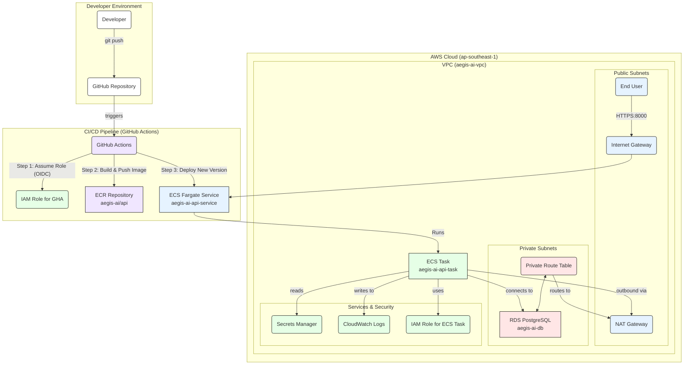

```mermaid
graph TD
    subgraph "Developer Environment"
        Dev(Developer) -- "git push" --> Github(GitHub Repository)
    end

    subgraph "CI/CD Pipeline (GitHub Actions)"
        Github -- "triggers" --> GA(GitHub Actions)
        GA -- "Step 1: Assume Role (OIDC)" --> IAM_GHA(IAM Role for GHA)
        GA -- "Step 2: Build & Push Image" --> ECR["ECR Repository<br>aegis-ai/api"]
        GA -- "Step 3: Deploy New Version" --> ECS_Service["ECS Fargate Service<br>aegis-ai-api-service"]
    end

    subgraph "AWS Cloud (ap-southeast-1)"
        subgraph "VPC (aegis-ai-vpc)"
            subgraph "Public Subnets"
                User(End User) -- "HTTPS:8000" --> IGW(Internet Gateway)
                IGW --> ECS_Service
                NAT(NAT Gateway)
            end

            subgraph "Private Subnets"
                RouteTable_Private(Private Route Table) <--> RDS["RDS PostgreSQL<br>aegis-ai-db"]
                RouteTable_Private -- "routes to" --> NAT
            end

            subgraph "Services & Security"
                Secrets(Secrets Manager)
                CloudWatch(CloudWatch Logs)
                IAM_ECS(IAM Role for ECS Task)
                IAM_GHA
            end

            ECS_Service -- "Runs" --> Task["ECS Task<br>aegis-ai-api-task"]
            Task -- "reads" --> Secrets
            Task -- "writes to" --> CloudWatch
            Task -- "uses" --> IAM_ECS
            Task -- "connects to" --> RDS
            Task -- "outbound via" --> NAT
        end
    end

    %% Styling
    classDef vpc fill:#FFF5E1,stroke:#000,stroke-width:2px;
    classDef public fill:#E6F3FF,stroke:#000;
    classDef private fill:#FFE6E6,stroke:#000;
    classDef security fill:#E6FFE6,stroke:#000;
    classDef cicd fill:#F0E6FF,stroke:#000;
    classDef dev fill:#FFFFFF,stroke:#000;
    class Dev,Github dev;
    class GA,ECR cicd;
    class VPC vpc;
    class IGW,ECS_Service,NAT,User public;
    class RouteTable_Private,RDS private;
    class Secrets,CloudWatch,IAM_ECS,IAM_GHA,Task security;
```
