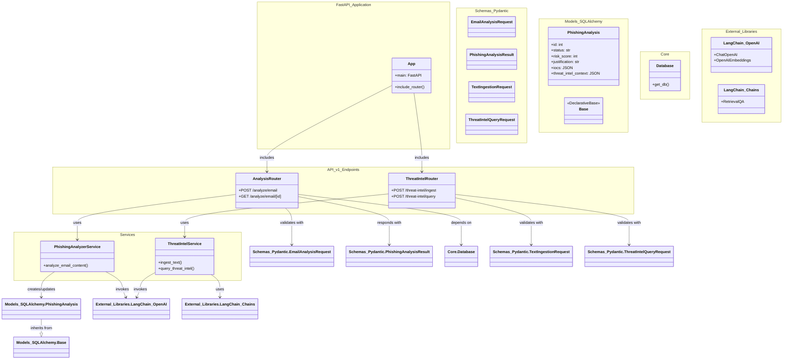

```mermaid
classDiagram
    direction TD

    %% Define the main components and group them by layer/module
    namespace FastAPI_Application {
        class App {
            +main: FastAPI
            +include_router()
        }
    }

    namespace API_v1_Endpoints {
        class AnalysisRouter {
            +POST /analyze/email
            +GET /analyze/email/[id]
        }
        class ThreatIntelRouter {
            +POST /threat-intel/ingest
            +POST /threat-intel/query
        }
    }

    namespace Services {
        class PhishingAnalyzerService {
            +analyze_email_content()
        }
        class ThreatIntelService {
            +ingest_text()
            +query_threat_intel()
        }
    }

    namespace Schemas_Pydantic {
        class EmailAnalysisRequest
        class PhishingAnalysisResult
        class TextIngestionRequest
        class ThreatIntelQueryRequest
    }

    namespace Models_SQLAlchemy {
        class PhishingAnalysis {
            +id: int
            +status: str
            +risk_score: int
            +justification: str
            +iocs: JSON
            +threat_intel_context: JSON
        }
        class Base {
            <<DeclarativeBase>>
        }
    }

    namespace Core {
        class Database {
            +get_db()
        }
    }
    
    namespace External_Libraries {
        class LangChain_OpenAI {
            +ChatOpenAI
            +OpenAIEmbeddings
        }
        class LangChain_Chains {
            +RetrievalQA
        }
    }

    %% Define the relationships between the components
    App --> AnalysisRouter : includes
    App --> ThreatIntelRouter : includes

    AnalysisRouter --> PhishingAnalyzerService : uses
    AnalysisRouter --> Schemas_Pydantic.EmailAnalysisRequest : validates with
    AnalysisRouter --> Schemas_Pydantic.PhishingAnalysisResult : responds with
    AnalysisRouter --> Core.Database : depends on

    ThreatIntelRouter --> ThreatIntelService : uses
    ThreatIntelRouter --> Schemas_Pydantic.TextIngestionRequest : validates with
    ThreatIntelRouter --> Schemas_Pydantic.ThreatIntelQueryRequest : validates with

    PhishingAnalyzerService --> Models_SQLAlchemy.PhishingAnalysis : creates/updates
    PhishingAnalyzerService --> External_Libraries.LangChain_OpenAI : invokes

    ThreatIntelService --> External_Libraries.LangChain_OpenAI : invokes
    ThreatIntelService --> External_Libraries.LangChain_Chains : uses

    Models_SQLAlchemy.PhishingAnalysis --|> Models_SQLAlchemy.Base : inherits from
```
