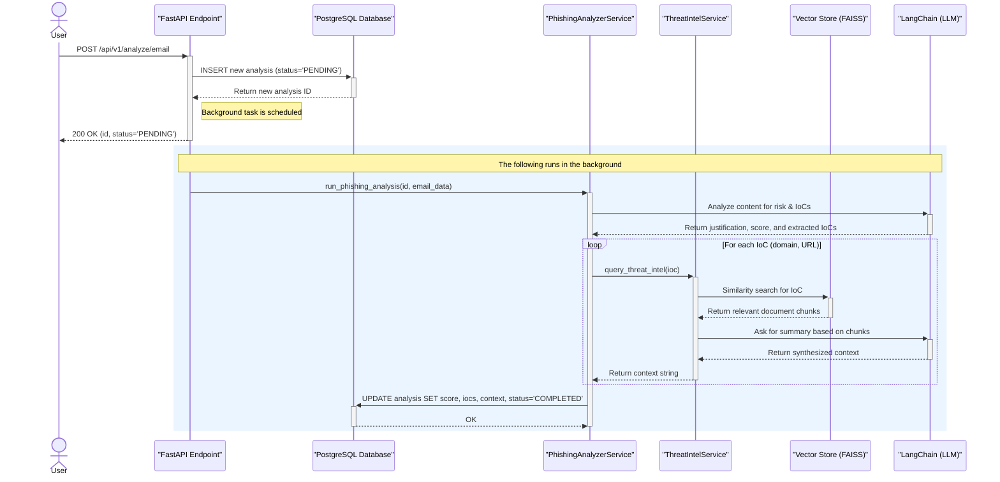

```mermaid
sequenceDiagram
    actor User
    participant API as "FastAPI Endpoint"
    participant DB as "PostgreSQL Database"
    participant Analyzer as "PhishingAnalyzerService"
    participant ThreatIntel as "ThreatIntelService"
    participant VectorStore as "Vector Store (FAISS)"
    participant LLM as "LangChain (LLM)"

    %% Initial Request/Response
    User->>+API: POST /api/v1/analyze/email
    API->>+DB: INSERT new analysis (status='PENDING')
    DB-->>-API: Return new analysis ID
    Note right of API: Background task is scheduled
    API-->>-User: 200 OK (id, status='PENDING')

    %% Background Processing
    rect rgb(235, 245, 255)
        note over API, LLM: The following runs in the background
        API->>+Analyzer: run_phishing_analysis(id, email_data)
        
        %% AI Analysis
        Analyzer->>+LLM: Analyze content for risk & IoCs
        LLM-->>-Analyzer: Return justification, score, and extracted IoCs

        %% Threat Correlation Loop (RAG Pattern)
        loop For each IoC (domain, URL)
            Analyzer->>+ThreatIntel: query_threat_intel(ioc)
            
            %% Step 1: Retrieval
            ThreatIntel->>+VectorStore: Similarity search for IoC
            VectorStore-->>-ThreatIntel: Return relevant document chunks
            
            %% Step 2: Generation
            ThreatIntel->>+LLM: Ask for summary based on chunks
            LLM-->>-ThreatIntel: Return synthesized context
            
            ThreatIntel-->>-Analyzer: Return context string
        end

        %% Final Database Update
        Analyzer->>+DB: UPDATE analysis SET score, iocs, context, status='COMPLETED'
        DB-->>-Analyzer: OK
        deactivate Analyzer
    end
```
