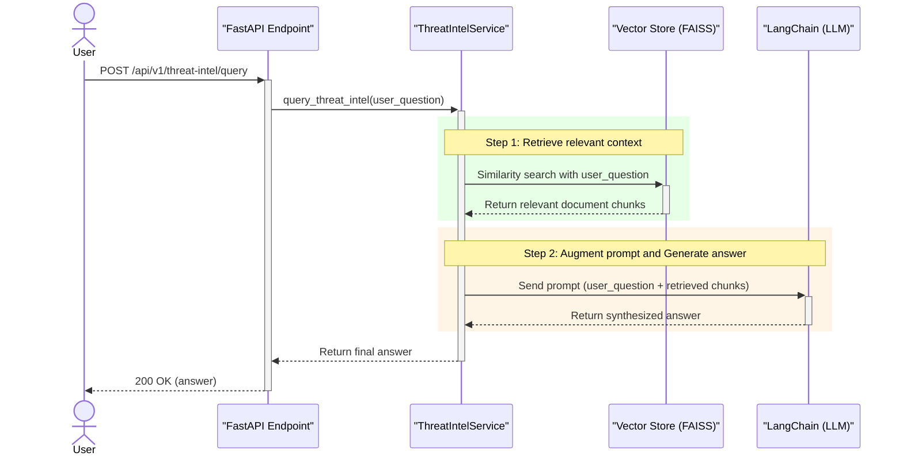

```mermaid
sequenceDiagram
    actor User
    participant API as "FastAPI Endpoint"
    participant RAG_Service as "ThreatIntelService"
    participant VectorStore as "Vector Store (FAISS)"
    participant LLM as "LangChain (LLM)"

    User->>+API: POST /api/v1/threat-intel/query
    API->>+RAG_Service: query_threat_intel(user_question)

    %% Step 1: Retrieval
    rect rgb(230, 255, 230)
        note over RAG_Service, VectorStore: Step 1: Retrieve relevant context
        RAG_Service->>+VectorStore: Similarity search with user_question
        VectorStore-->>-RAG_Service: Return relevant document chunks
    end

    %% Step 2: Augmentation & Generation
    rect rgb(255, 245, 230)
        note over RAG_Service, LLM: Step 2: Augment prompt and Generate answer
        RAG_Service->>+LLM: Send prompt (user_question + retrieved chunks)
        LLM-->>-RAG_Service: Return synthesized answer
    end
    
    RAG_Service-->>-API: Return final answer
    API-->>-User: 200 OK (answer)
```
