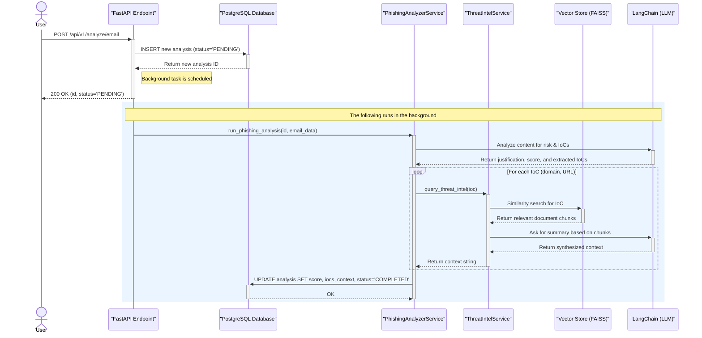
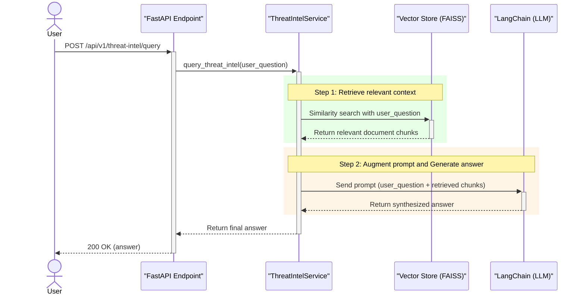
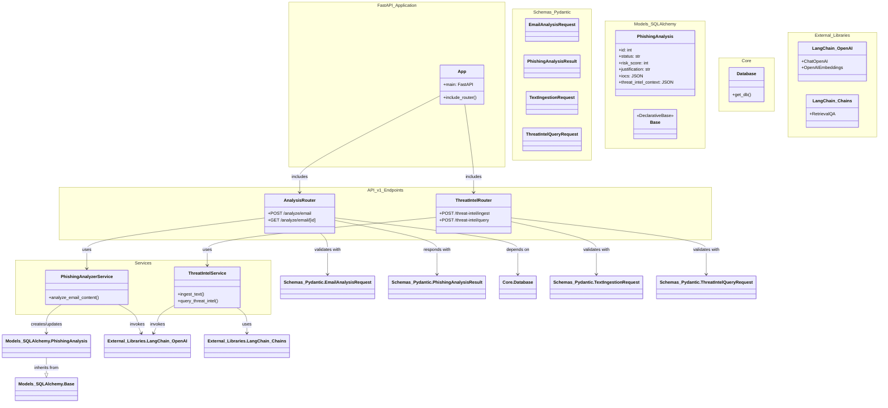
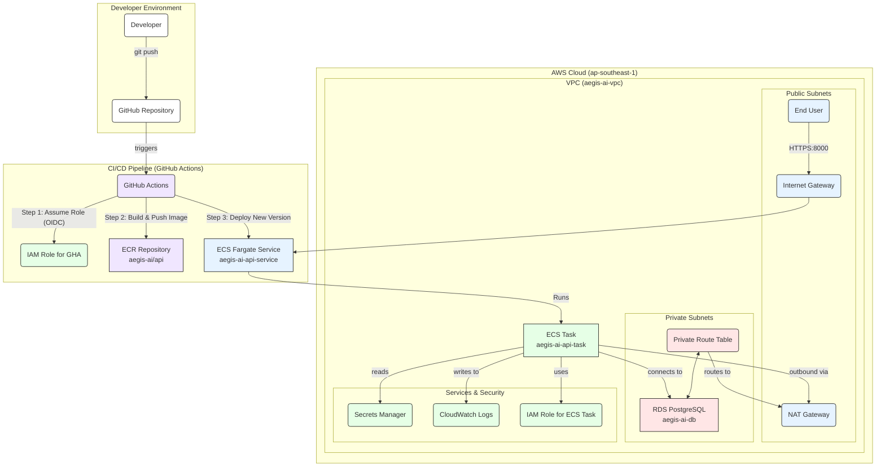

# Aegis AI 🛡️

*An AI-Powered Cyber Data Risk & Resilience Platform*

[](https://github.com/zhu-weijie/aegis-ai/actions/workflows/ci.yml)

## About The Project

Aegis AI is a demonstration project built to showcase the application of modern AI/ML techniques to solve real-world problems in Cyber Data Risk & Resilience. It provides an API-driven platform to automate the analysis of potential threats, reducing manual toil for security analysts and enabling faster response times.

This project was developed to exhibit proficiency in Python, backend development, AI integration (LLMs), Infrastructure as Code, and CI/CD automation, directly aligning with the skills required for a modern security development role.

## Core Features

-   **AI-Powered Phishing Triage**: Submit email content via an API endpoint. The system uses a Large Language Model (LLM) to assess the phishing risk, provide a justification, and automatically extract structured **Indicators of Compromise (IoCs)** like URLs, domains, and email addresses.

-   **Automated Threat Intelligence Correlation**: Ingest unstructured threat intelligence reports (e.g., security blog posts, vulnerability disclosures). The system uses **Retrieval-Augmented Generation (RAG)** to create an internal knowledge base that can be queried in natural language.

-   **Closed-Loop Threat Enrichment**: The platform automatically correlates IoCs found in new phishing submissions against the internal threat intelligence knowledge base, providing immediate context if an indicator has been seen in previous reports.

## Tech Stack & Architecture

### Application & Data
-   **Backend**: Python 3.12, FastAPI
-   **Database**: PostgreSQL
-   **ORM & Migrations**: SQLAlchemy, Alembic
-   **AI/ML**: LangChain, OpenAI
-   **Containerization**: Docker, Docker Compose

### DevOps & Cloud
-   **Infrastructure as Code**: Terraform
-   **CI/CD**: GitHub Actions
-   **Cloud Provider**: Amazon Web Services (AWS)
-   **Compute**: ECS (Elastic Container Service) with Fargate
-   **Database**: RDS (Relational Database Service)
-   **Container Registry**: ECR (Elastic Container Registry)
-   **Networking**: VPC, Public/Private Subnets, NAT Gateway
-   **Security**: IAM, Secrets Manager, Security Groups

## Local Development Setup

To run this project locally, follow these steps:

1.  **Clone the repository:**
    ```bash
    git clone https://github.com/zhu-weijie/aegis-ai.git
    cd aegis-ai
    ```

2.  **Create and activate a virtual environment:**
    ```bash
    python3.12 -m venv venv
    source venv/bin/activate
    ```

3.  **Install dependencies:**
    ```bash
    pip install -r requirements.txt
    ```

4.  **Configure local environment:**
    -   Copy the example environment file: `cp .env.local.example .env.local`
    -   Fill in the `POSTGRES_*` and `OPENAI_API_KEY` variables in `.env.local`.

5.  **Start the database container:**
    ```bash
    docker compose up -d db
    ```

6.  **Apply database migrations:**
    ```bash
    alembic upgrade head
    ```

7.  **Run the FastAPI application:**
    ```bash
    uvicorn api.main:app --reload
    ```
    The application will be available at `http://127.0.0.1:8000`.

## API Endpoints

The interactive API documentation (via Swagger UI) is available at the `/docs` endpoint when the application is running.

-   `POST /api/v1/analyze/email`: Submit an email for analysis.
-   `GET /api/v1/analyze/email/{analysis_id}`: Retrieve the results of an analysis.
-   `POST /api/v1/threat-intel/ingest`: Ingest a text document into the RAG knowledge base.
-   `POST /api/v1/threat-intel/query`: Ask a question about the ingested threat intelligence.

## Deployment (IaC & CI/CD)

This project is designed for fully automated deployment to AWS.

-   **Infrastructure**: All AWS resources are defined as code using **Terraform** in the `/terraform` directory. This includes networking, databases, container services, and IAM roles.
-   **Continuous Integration**: The `.github/workflows/ci.yml` pipeline automatically runs linting (`ruff`) and formatting (`black`) checks on every push and pull request to the `main` branch.
-   **Continuous Deployment**: The `.github/workflows/cd.yml` pipeline is triggered manually (`workflow_dispatch`). It builds the production Docker image, pushes it to ECR, and updates the ECS service to deploy the new version. It uses a secure OIDC connection, eliminating the need for long-lived AWS secrets in GitHub.

## Next Steps & Current Status

The project has successfully implemented all core features and the full DevOps pipeline. The immediate next step is to resolve the final container startup issue.

-   [x] Initial project setup (FastAPI, Docker)
-   [x] Database integration (PostgreSQL, Alembic)
-   [x] Feature 1: AI Phishing Triage & IoC Extraction
-   [x] Feature 2: RAG Threat Intelligence & Correlation
-   [x] CI Pipeline with GitHub Actions
-   [x] Full AWS infrastructure provisioned with Terraform
-   [x] CD Pipeline with GitHub Actions

## Design Diagrams

### Phishing Analysis Sequence Diagram



### Threat Intelligence RAG Sequence Diagram



### Class Diagram



### AWS Infrastructure Diagram


